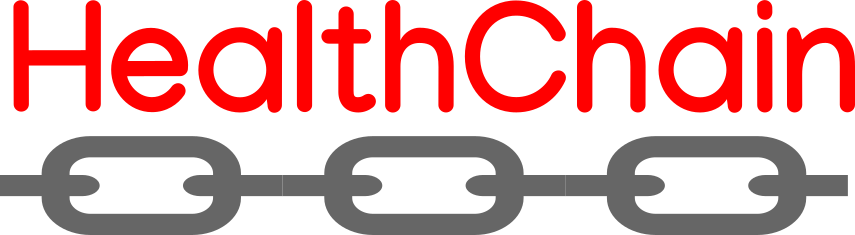

<p align="center">A decentralized health record store with encrypted client records </p>


# Purpose 

HealthChain is a decentralized health record system. Our aim is to give health professionals rapid and easy access to their patients health records, regardless of location. This is done by assigning a private key to each person in the database, which when entered will unlock access to the patients medical records.

Consider the situation 

```
Tom from the US is vacationing in Greece. While there he encounters an injury and is sent to the hospital. 
Before a Doctor can provide him help, they may need to get his medical records mailed from home. 
Instead, the doctor can use Tom's private key to get access to his health information. 
With quick access to these records, the Doctor can more efficiently and rapidly treat Tom so that 
he can recover and enjoy his vacation.
```


# Usage 

## Prerequisites
 * Golang 1.12 or later 
 * Node 10.16.0 or later


## Running
```
cd HealthChain
```

### Backend:
```
cd backend
go build . 
./healthchain
```

### Frontend:
```
cd frontend
npm install
npm run dev
```


# Testing

```
cd HealthChain
```

### Backend unit tests:
```
cd backend
go test -v
```

### Frontend tests:
```
cd frontend
npm test
```


# Contribution

## Authors

* **Noah Deahl** - *Initial work* - [ndeahl1999](https://github.com/ndeahl1999)
* **Andrew Qu** - *Initial work* - [quuu](https://github.com/quuu)
* **Rich Turiano** - *Initial work* - [kiwis0](https://github.com/kiwis0)
* **Rahul Puppala** - *Initial work* - [rpuppala6](https://github.com/rpuppala6)
